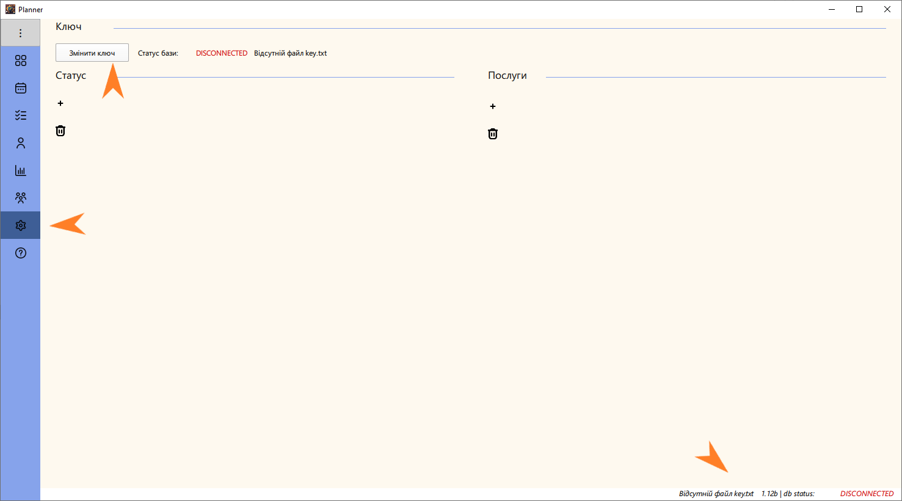
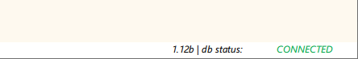
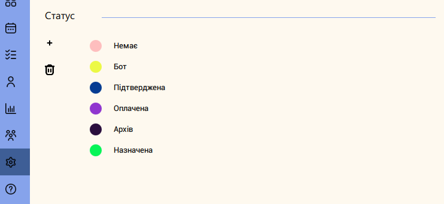
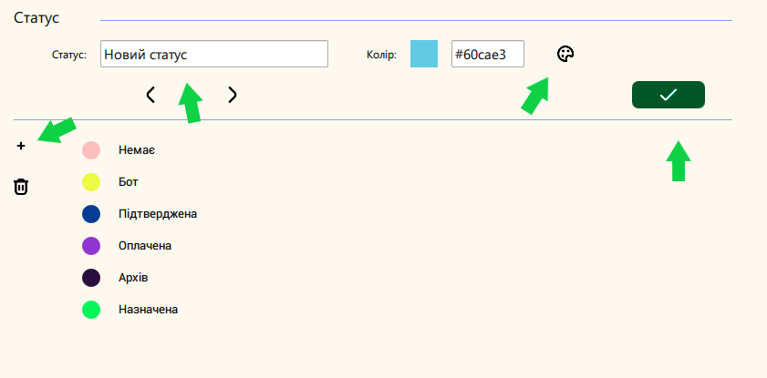
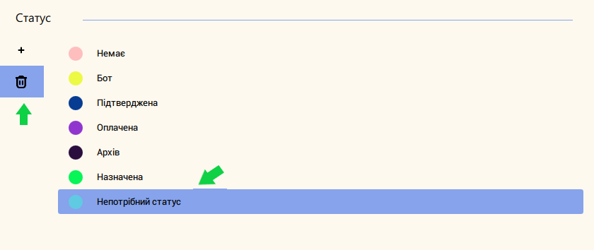

# Как это работает

## То что нужно сделать один раз

Настройки - это то, с чего нужно начать. 

Программа работает с сетевой базой данных, поэтому при первом запуске у вас будет висеть
ошибка подключения к базе данных из-за отсутствия ключа. Файл key.txt вы получите при регистрации.

<figure markdown>
  { width="750" }
</figure>

* перейдите в раздел настройки
* нажмите кнопку "Сменить ключ"
* выберите, полученный при регистрации, файл key.txt

Программа сама подключится и результат должен быть такой:

<figure markdown>
  { width="300" }
</figure>

!!! failure ""
    Если возникли какие-то ошибки при подключении проверьте, не изменился ли у вас IP адрес. 
    Сервис для проверки внешнего IP - https://2ip.ua/ua/. Сверьте с тем, который передали при регистрации. 
    В любом случае, это не нормально поэтому, напишите в Telegram поддержки.

Если подключение есть - ура, можно уже что-то делать. И на этом эпате предполагается опреленный 
порядок действий, хотя вы можете выполнить эти шаги в любом порядке

- настройка статусов встреч
- настройка прайс-листа услуг
- специалисты

## Статусы

Статусы нужны для визуальной идентификации состояния встреч. 

<figure markdown>
  { width="600" }
</figure>

Как это работает? Например, приходит звонок и вы назначаете встречу. На этом этапе у встречи может быть статус - "Назначена". В свое 
время приходит клиент, и ему оказана услуга - здесь подходит статус "Выполнена". 
Если у вас предполагается предоплата, можно ввести статусы "Оплачено" и "Нет оплаты". Также 
неплохо иметь статусы для случаев, когда клиент не пришел, услуга не выполнена или оказана
частично. Статусы отлично подходят для случаев, когда есть несколько этапов при регистрации
встречи например: Назначение - Согласование документов - Диагностика - Оплата - Встреча.
Состав статусов может быть любой, на ваше усмотрение.

В Planner статусам присваиваются цвета, что позволяет легко визуально определить на каком
этапе находится встреча. На самом деле, если вам не особо нужны статусы, вы можете их не заводить вовсе.
Изначально в таблице статусов будет статус "Нету" и "Бот", они нужны для работы внутренней логики программы. 

!!! tip ""
    Внутренние статусы вы не можете удалить, но изменить можете полностью.

### Добавить статус
    
Чтобы добавить новый статус нажмите "+", рядом с таблицей. В форме введите название, выберите цвет
и нажмите "Сохранить"

<figure markdown>
  { width="300" }
</figure>

### Удалить статус

Для удаления ненужного статуса, выберите его в таблице и нажмите удалить.

<figure markdown>
  { width="300" }
</figure>

!!! tip ""
    Если вы статусы вы не можете удалить, но изменить можете полностью.

Для ценителей статистики в разделе отчеты, есть отчет который формируется
по статусам встреч, обязательно попробуйте.

## Услуги - Прайс-листы

Список услуг

## Сотрудники

В

